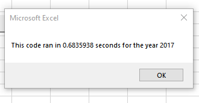

# VBA of Wall Street

## Overview of Project:

The purpose of this project is to provide Steve an analysis of All Green Stocks by using Macros in VBA to pull data from the main spreadsheet and output each stock's Total Daily Volume and Yearly Returns. I also refactored the original script I wrote to loop through all the data one time in order to efficiently collect the same information for thousands of stocks in case Steve wants to look at more stocks than the 12 provided in the worksheet.

## Results: 

### The Process

When pulling data for the Total Daily Volume and Yearly Returns for each stock I made a Subroutine to account for each ticker, tickerVolume, tickerStartingPrice and tickerEndingPrice by setting them into arrays.

After each array is set up, I would then create a single loop to account for obtaining the tickerVolume, tickerStartingPrices and tickerEndingPrices as well as increasing the tickerIndex by one whenever the loop reaches a new ticker. For acheiving the totalVolume, we want each cell under the Volume column associated with their respective ticker to add up together. For tickerStarting Prices, we want to make sure the cell in the current row is the first row with the selected tickerIndex and vice versa for the tickerEndingPrice.

Lastly once all the loops are finished, we are going to output our data into a row under Cells A3, B3 and C3. From A4 - A15 and B4 - B15, each cell would hold the respective ticker and total daily volume. From C4 - C15, we will use a formula dividing the tickerEndingPrices for each ticker divided by the tickerStartingPrices for each ticker subtracted by 1. 

After all data is outputted, we create some formatting changes, making sure each cell looks presentable and easy to read. Our Yearly Returns show percentages as well as highlight green when we have higher than 0% and conversely highlight red when below 0%.

### Analysis 

Based on the data pulled for both 2017 and 2018, we can see clear differences on the performance of most stocks between both years. 

2017 was a positive year for the majority of each stock in terms of performance. Each stock except for TERP (TerraForm Power) had a positive yearly return. DQ (DAQO New Energy) was definitely the most profitable with 199.4% in yearly returns.

On the other hand, 2018 was a mostly negative year with only two stocks ENPH (Enphase Energy) and RUN (SunRun Inc) performing positively with 81.9% and 84.0% in yearly returns respectively. DQ's stocks plummetted to -62.6% and switched from being the highest performer in 2017 to the lowest performer in 2018. (Steve's parents probably won't like that)

### Run time

When comparing how fast the original code I created to the new refactored one. I noticed the refactored code was significantly faster than the original. Here are the results:

#### 2017 Original versus Refactored: 

 

#### 2018 Original versus Refactored:

 

## Summary

The advantages of refactoring code are that it allows for more efficient and quicker turnaround times for the subroutine to fully complete. The disadvantage is that it can require more extensive knowledge of VBA as well as important variables we need to have set in place. Otherwise, the code will not run and give various errors if not done right. 

These pros and cons can be applied toward my original VBA script. While my old script required the subroutine to loop multiple times with nested loops, the refactored one only did one loop to resolve itself and provided results much faster. On the other hand, it was much harder to make sure it ran smoothly. I researched extensively and sought out help from my peers to make sure my code had everything it needed to execute properly. Ultimately, refactoring is worth the effort if you're looking to use it for various datasets.

